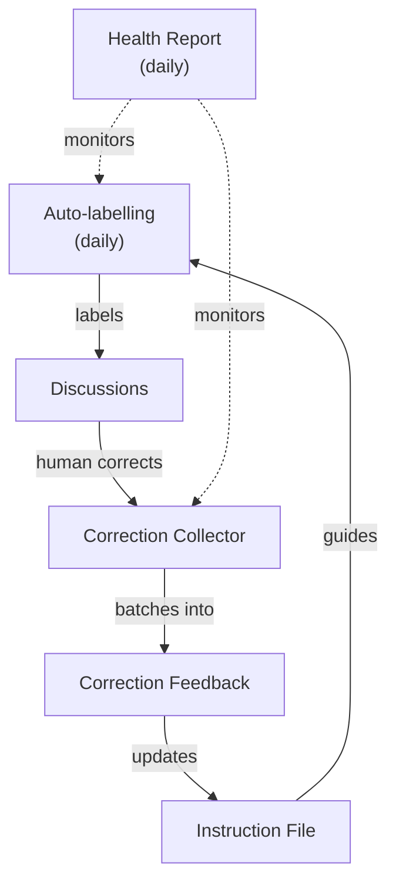

# community-ops

This repo hosts automated discussion labeling logic for [`githubnext/aw-community-discussions`](https://github.com/githubnext/aw-community-discussions) built with [GitHub Agentic Workflows](https://github.com/github/gh-aw).

## Overview

## Workflows

| Workflow | What it does | Trigger |
| --- | --- | --- |
| [`auto-labelling.md`](.github/workflows/auto-labelling.md) | Labels discussions using the [instruction file](.github/instructions/community-discussion-labeling.md) | daily, `workflow_dispatch` |
| [`labelling-correction-collector.yml`](.github/workflows/labelling-correction-collector.yml) | Deterministically collects trusted label corrections into parent issues with linked signal sub-issues | `repository_dispatch` |
| [`labelling-correction-feedback.md`](.github/workflows/labelling-correction-feedback.md) | Reviews one collected parent issue and raises an instruction-update PR when the evidence supports it | `workflow_dispatch`, `label_command` (`update-instructions`) |
| [`labelling-health-report.md`](.github/workflows/labelling-health-report.md) | Publishes a rolling report on labelling quality, correction pressure, and open instruction debt | daily |

### Actions secrets

| Secret | Workflows | Permissions needed |
| --- | --- | --- |
| `COPILOT_GITHUB_TOKEN` | All | Copilot CLI auth |
| `COMM_COMM_DISCUSSIONS_TOKEN` | `auto-labelling`, `labelling-correction-collector` | Contents (read), Discussions (read & write) on the target repo |
| `COMM_COMM_OPS_ISSUES_TOKEN` | `auto-labelling`, `labelling-correction-collector`, `labelling-health-report` | Issues (write) on the sidecar repo |

### How to review label corrections

1. Wait for correction signals to accumulate in a **parent intake issue**.
2. When the parent has enough evidence, add the **`update-instructions`** label.
3. The workflow opens a **draft PR** updating the instruction file — review and merge it.
